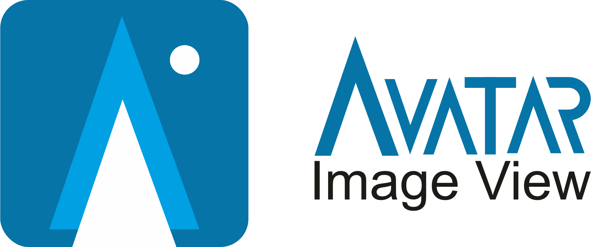

Avatar-Image-View
===

<p>
<a href="https://github.com/alvince/AvatarImageView">
    
</a>
<a href="https://opensource.org/licenses/MIT">
    
</a>
<a href="https://jitpack.io/#alvince/AvatarImageView">
    
</a>
<a href="https://github.com/996icu/996.ICU/blob/master/LICENSE">
    
</a>
<a href="https://996.icu"></a>
</p>



<font style="font-size:1.5em">A fast roundable and strokeable ImageView for show avatar.</font>

### Gradle

Add it to your build.gradle with:

```gradle
allprojects {
    repositories {
        maven { url "https://jitpack.io" }
    }
}
```

and:

```gradle
dependencies {
    implementation 'com.github.alvince:AvatarImageView:1.0.3'
}
```

### Sample

##### Demo 下载
<a href='https://play.google.com/store/apps/details?id=me.alvince.sample.avatarimageview&pcampaignid=MKT-Other-global-all-co-prtnr-py-PartBadge-Mar2515-1'>
    
</a>

#### ScreenShot

<div>
    
    
<div>

### Usage

```xml
<me.alvince.android.avatarimageview.AvatarImageView
        android:id="@+id/avatarImageView"
        android:layout_width="48dp"
        android:layout_height="48dp"
        app:img_drawImageReplace="true"
        app:img_foregroundColorPressed="@color/pressed"
        app:img_roundedCorner="4dp"
        app:img_strokeColor="@color/colorStroke"
        app:img_strokeWidth="1dp" />
```

### Features

- [x] 图片圆角显示
- [x] 显示边框
- [x] 圆形图片显示

### Attributes

| Xml attr                     | Description        | Default       |
| ---------------------------- | ------------------ | ------------- |
| `img_drawImageReplace`       | 使用自定义显示效果 | `true`        |
| `img_foregroundColorPressed` | 按下状态前景色     | `TRANSPARENT` |
| `img_roundAsCircle`          | 圆形显示           | `false`       |
| `img_roundedCorner`          | 圆角半径           | `5dp`         |
| `img_strokeColor`            | 边框颜色           | `TRANSPARENT` |
| `img_strokeWidth`            | 边框宽度           | `2dp`         |

### Gratitude

Logo provided by [Famil Qasimov](https://github.com/familqasimov)


License
---

```
Copyright (c) 2018 alvince

Permission is hereby granted, free of charge, to any person obtaining a copy
of this software and associated documentation files (the "Software"), to deal
in the Software without restriction, including without limitation the rights
to use, copy, modify, merge, publish, distribute, sublicense, and/or sell
copies of the Software, and to permit persons to whom the Software is
furnished to do so, subject to the following conditions:

The above copyright notice and this permission notice shall be included in all
copies or substantial portions of the Software.

THE SOFTWARE IS PROVIDED "AS IS", WITHOUT WARRANTY OF ANY KIND, EXPRESS OR
IMPLIED, INCLUDING BUT NOT LIMITED TO THE WARRANTIES OF MERCHANTABILITY,
FITNESS FOR A PARTICULAR PURPOSE AND NONINFRINGEMENT. IN NO EVENT SHALL THE
AUTHORS OR COPYRIGHT HOLDERS BE LIABLE FOR ANY CLAIM, DAMAGES OR OTHER
LIABILITY, WHETHER IN AN ACTION OF CONTRACT, TORT OR OTHERWISE, ARISING FROM,
OUT OF OR IN CONNECTION WITH THE SOFTWARE OR THE USE OR OTHER DEALINGS IN THE
SOFTWARE.

----------

Copyright (c) 2019 alvince

"Anti 996" License Version 1.0 (Draft)

Permission is hereby granted to any individual or legal entity
obtaining a copy of this licensed work (including the source code,
documentation and/or related items, hereinafter collectively referred
to as the "licensed work"), free of charge, to deal with the licensed
work for any purpose, including without limitation, the rights to use,
reproduce, modify, prepare derivative works of, distribute, publish
and sublicense the licensed work, subject to the following conditions:

1. The individual or the legal entity must conspicuously display,
without modification, this License and the notice on each redistributed
or derivative copy of the Licensed Work.

2. The individual or the legal entity must strictly comply with all
applicable laws, regulations, rules and standards of the jurisdiction
relating to labor and employment where the individual is physically
located or where the individual was born or naturalized; or where the
legal entity is registered or is operating (whichever is stricter). In
case that the jurisdiction has no such laws, regulations, rules and
standards or its laws, regulations, rules and standards are
unenforceable, the individual or the legal entity are required to
comply with Core International Labor Standards.

3. The individual or the legal entity shall not induce, suggest or force
its employee(s), whether full-time or part-time, or its independent
contractor(s), in any methods, to agree in oral or written form, to
directly or indirectly restrict, weaken or relinquish his or her
rights or remedies under such laws, regulations, rules and standards
relating to labor and employment as mentioned above, no matter whether
such written or oral agreements are enforceable under the laws of the
said jurisdiction, nor shall such individual or the legal entity
limit, in any methods, the rights of its employee(s) or independent
contractor(s) from reporting or complaining to the copyright holder or
relevant authorities monitoring the compliance of the license about
its violation(s) of the said license.

THE LICENSED WORK IS PROVIDED "AS IS", WITHOUT WARRANTY OF ANY KIND,
EXPRESS OR IMPLIED, INCLUDING BUT NOT LIMITED TO THE WARRANTIES OF
MERCHANTABILITY, FITNESS FOR A PARTICULAR PURPOSE AND NONINFRINGEMENT.
IN NO EVENT SHALL THE COPYRIGHT HOLDER BE LIABLE FOR ANY CLAIM,
DAMAGES OR OTHER LIABILITY, WHETHER IN AN ACTION OF CONTRACT, TORT OR
OTHERWISE, ARISING FROM, OUT OF OR IN ANY WAY CONNECTION WITH THE
LICENSED WORK OR THE USE OR OTHER DEALINGS IN THE LICENSED WORK.
```
