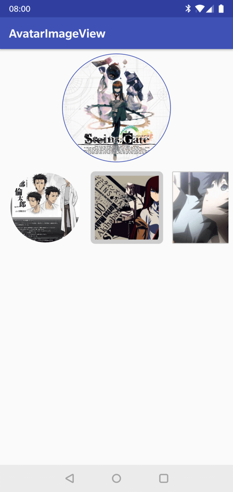
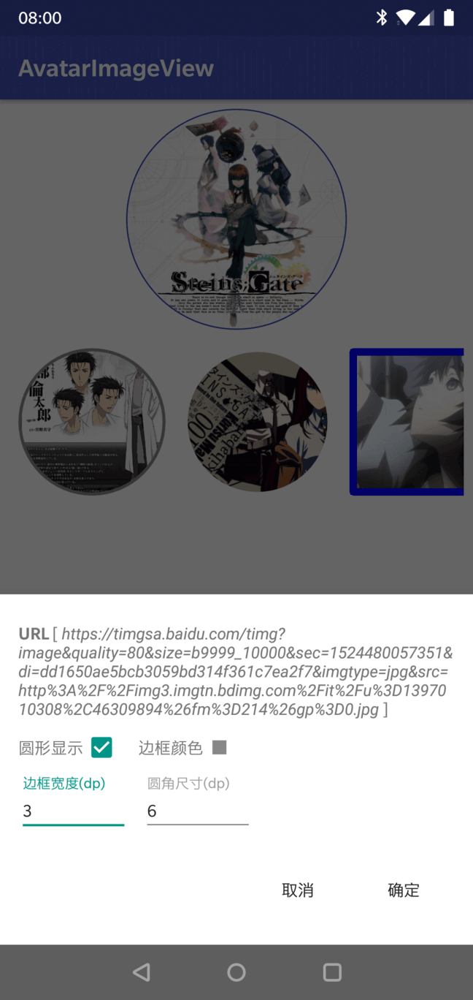

<p align="center">
  
</p>

AvatarImageView
===


<a href="https://github.com/alvince/AvatarImageView">
    
</a>
<a href="https://opensource.org/licenses/MIT">
    
</a>
<a href="https://jitpack.io/#alvince/AvatarImageView">
    
</a>

A fast roundable and strokeable ImageView for show avatar.

### Gradle

Add it to your build.gradle with:

```gradle
allprojects {
    repositories {
        maven { url "https://jitpack.io" }
    }
}
```

and:

```gradle
dependencies {
    implementation 'com.github.alvince:AvatarImageView:1.0.2'
}
```

### Sample

##### Demo 下载
<a href='https://play.google.com/store/apps/details?id=me.alvince.sample.avatarimageview&pcampaignid=MKT-Other-global-all-co-prtnr-py-PartBadge-Mar2515-1'>
    
</a>

#### ScreenShot

<div>
    
    
<div>

### Usage

```xml
<me.alvince.android.avatarimageview.AvatarImageView
        android:id="@+id/avatarImageView"
        android:layout_width="48dp"
        android:layout_height="48dp"
        app:img_drawImageReplace="true"
        app:img_foregroundColorPressed="@color/pressed"
        app:img_roundedCorner="4dp"
        app:img_strokeColor="@color/colorStroke"
        app:img_strokeWidth="1dp" />
```

### Features

- [x] 图片圆角显示
- [x] 显示边框
- [x] 圆形图片显示

### Attributes

| Xml attr                     | Description        | Default       |
| ---------------------------- | ------------------ | ------------- |
| `img_drawImageReplace`       | 使用自定义显示效果 | `true`        |
| `img_foregroundColorPressed` | 按下状态前景色     | `TRANSPARENT` |
| `img_roundAsCircle`          | 圆形显示           | `false`       |
| `img_roundedCorner`          | 圆角半径           | `5dp`         |
| `img_strokeColor`            | 边框颜色           | `TRANSPARENT` |
| `img_strokeWidth`            | 边框宽度           | `2dp`         |

License
---

```
Copyright (c) 2018 alvince

Permission is hereby granted, free of charge, to any person obtaining a copy
of this software and associated documentation files (the "Software"), to deal
in the Software without restriction, including without limitation the rights
to use, copy, modify, merge, publish, distribute, sublicense, and/or sell
copies of the Software, and to permit persons to whom the Software is
furnished to do so, subject to the following conditions:

The above copyright notice and this permission notice shall be included in all
copies or substantial portions of the Software.

THE SOFTWARE IS PROVIDED "AS IS", WITHOUT WARRANTY OF ANY KIND, EXPRESS OR
IMPLIED, INCLUDING BUT NOT LIMITED TO THE WARRANTIES OF MERCHANTABILITY,
FITNESS FOR A PARTICULAR PURPOSE AND NONINFRINGEMENT. IN NO EVENT SHALL THE
AUTHORS OR COPYRIGHT HOLDERS BE LIABLE FOR ANY CLAIM, DAMAGES OR OTHER
LIABILITY, WHETHER IN AN ACTION OF CONTRACT, TORT OR OTHERWISE, ARISING FROM,
OUT OF OR IN CONNECTION WITH THE SOFTWARE OR THE USE OR OTHER DEALINGS IN THE
SOFTWARE.
```
